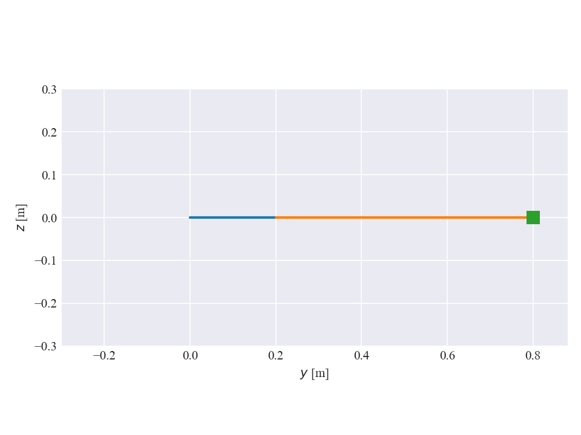

# simengine3D
`simengine3D` is a general purpose 3-dimensional physics simulation engine 
written entirely in python. I created it in grad school while taking "ME 751: Advanced Computational Multibody Dynamics." Instead of deriving the governing differential equations of a system by hand, `simengine3D` allows a user to compose an arbitrary mechanical system in 3D space by defining rigid bodies (inerital properties and dimensions), and joints that connect bodies (ball joints, pin joints, etc.). The user can then apply external loads to the system (springs, dampers, control actuators) and simulate the time evolution of the system (recording reaction torques/forces and system kinematics along the way)

# Installation
To install, fork this repository and then clone it locally to your machine. Then: 
1. (Optional) Create a virtual environment before installing using your tool of choice
2. Navigate terminal to folder containing `pyproject.toml` file and then:
   - For general usage: `pip install .` 
   - If you wish to edit source code: `pip install -e .` 

# How to Use

You will almost always start using `simengine3D` by creating a a `System` object. After instantiating a `System`, you can then add `RigidBody` objects to the system and define joints between the bodies. The easiest way to get started with `simengine3D` is to look at the examples in the `examples` folder.

# Contributing
### Notation
A combination of CamelCase and underscore notation is used throughout the code.

CamelCase is used for class names only.

Underscores are used for methods and attributes. 